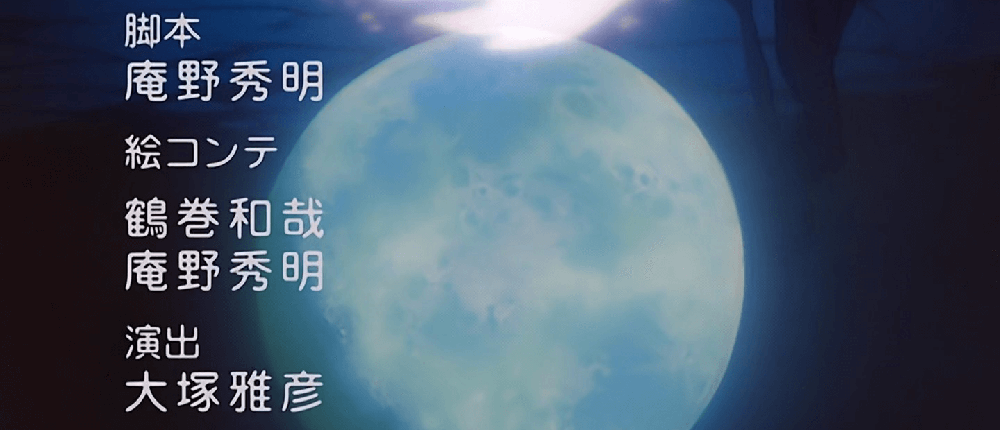

# 日本語が分かりません.

-   🌆 From **Rancagua**, **Chile**.
-   🗿 **Computer Science Engineer** with a **Bachelor of Science in Engineering**.
-   💼 Currently working as **CIO** at **RedOcean**
-   🔎 ✨ More info about me at my **[portfolio](https://ariel-salgado.github.io/)**.

##

<h3 align="center">Useless stats:</h3>

    

##

<h3 align="center">Some tools that i've used:</h3>

  

  

